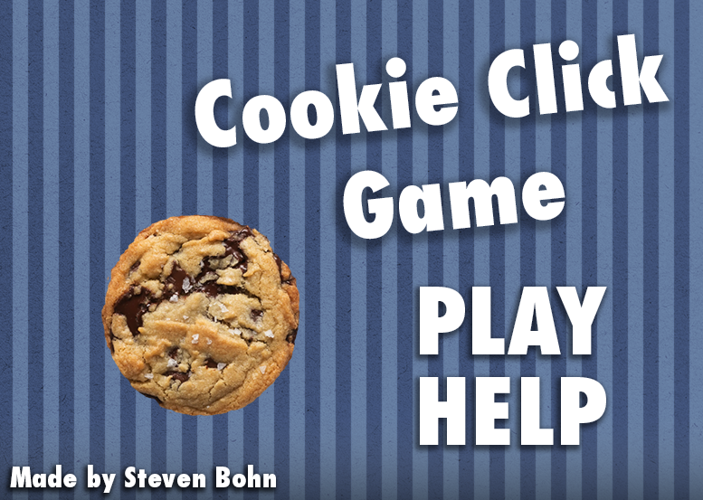
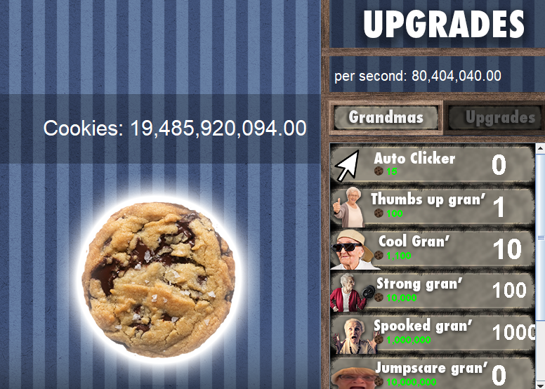
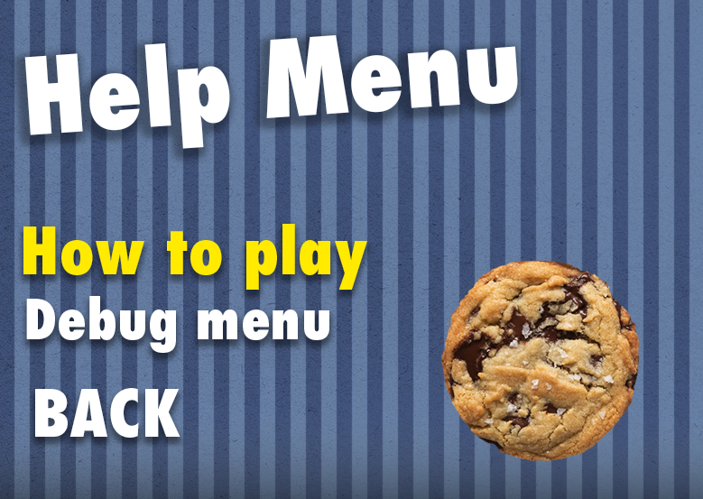
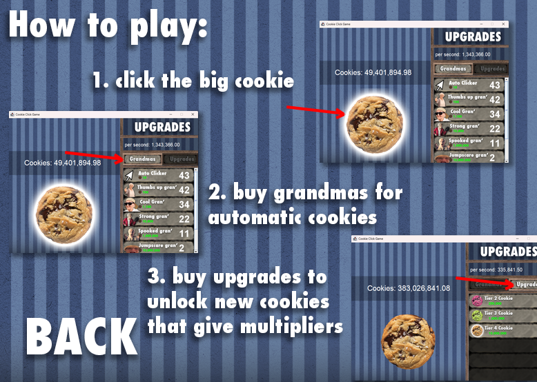
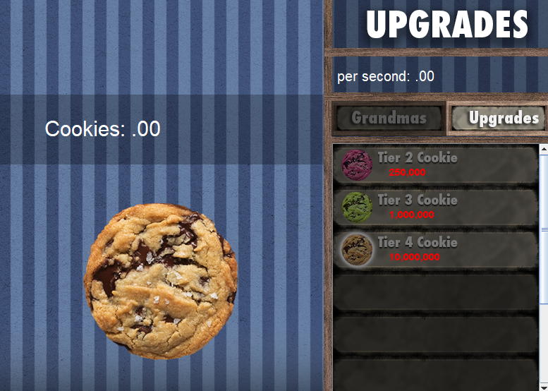
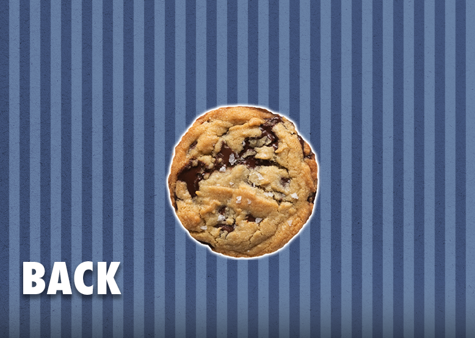

Cookie Clicker Game  
By Steven Bohn  
Screenshots from in game:

An idle clicker made in Java. The goal is to get as many cookies as you can, click the cookie, buy upgrades, and get more cookies.

Run instructions:  
\-Clone the repo  
\-Open in vsCode or ide of choice  
\-run "Runner.java"

Features:  
Unique pictures  
Fun upgrades   
Game saving  
Real time updating

Build with:  
openjdk 26.0.1  
javax.swing, java.awt, and java.io

What I learned:  
How object oriented programming ties into game development, especially the usefulness of inheritance for the buttons. Saving game state logic, General game loop logic, and how to incorporate game art with simple swing tools. Also gained experience with using Git for version control. Most work was done outside of class, and I had a lot of fun getting feedback on the game from my peers and teacher.
